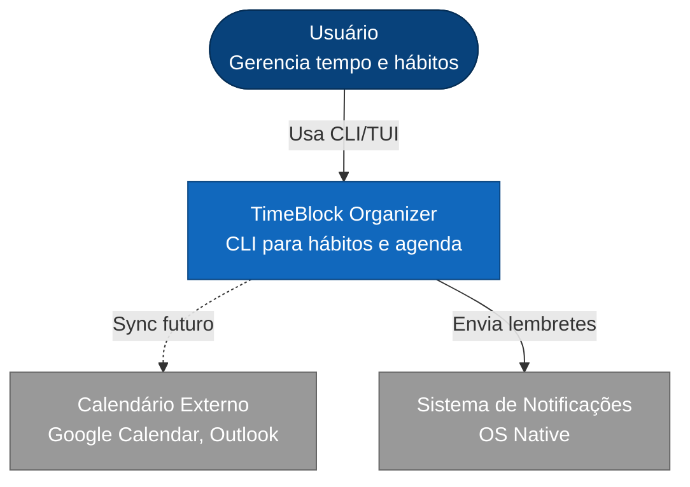
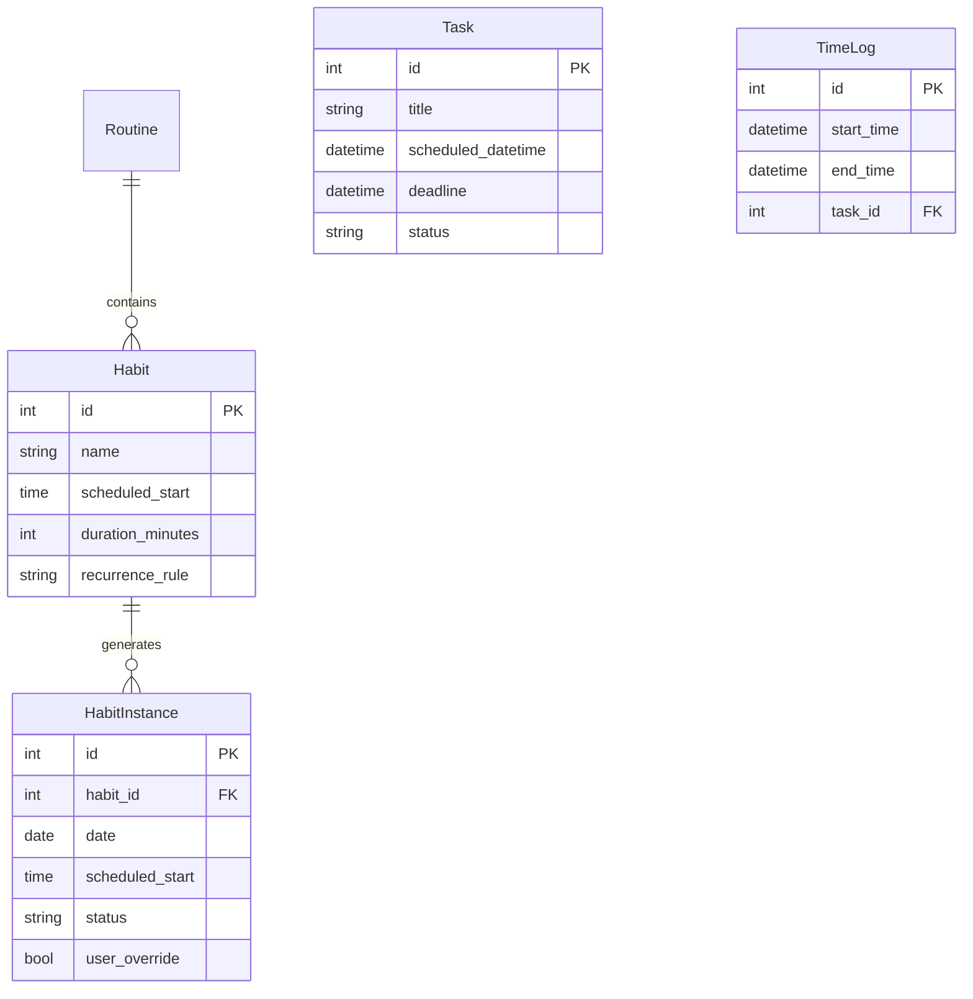
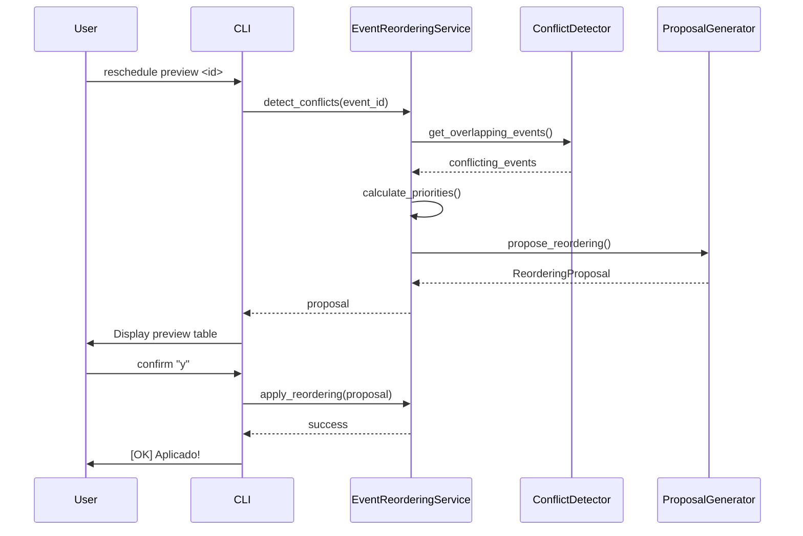
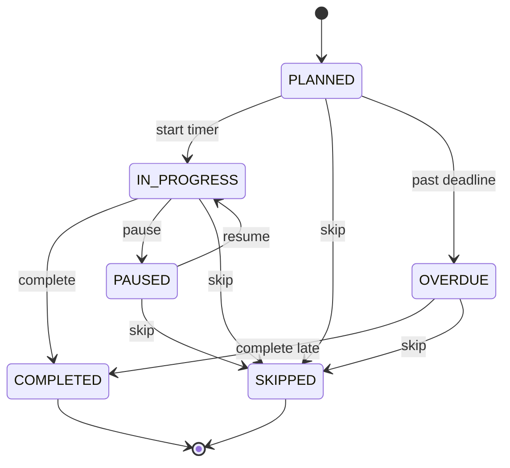

# TimeBlock Organizer

> Sistema desenvolvido para gerenciamento de tempo via CLI com reordenamento automático de eventos

[](https://github.com/fabiodelllima/timeblock-organizer/releases/tag/v1.2.0)
[](https://www.python.org/downloads/)
[](tests/)
[](tests/)
[](.github/workflows/ci.yml)
[](LICENSE)
[](docs/)

## Visão Geral

TimeBlock Organizer é uma ferramenta CLI para gerenciamento de tempo usando time blocking e detectação automática de conflitos e sugere reordenamento de eventos baseado em prioridades.

**Diferencial:** Sistema adaptativo que reorganiza sua agenda automaticamente quando surgem conflitos, respeitando prioridades e minimizando interrupções.

**Roadmap v2.0:** Sincronização offline-first entre Linux e Android (Termux) - [Ver Roadmap](docs/archived/10-meta/ROADMAP.md)

## Status do Projeto

- **Versão Atual:** v1.2.0 (Produção)
- **Próxima Release:** v2.0.0-alpha (Mar 2026)
- **Features em Desenvolvimento:**
  - Queue-Based Sync (ADR-012)
  - Offline-First Schema (ADR-013)
  - Connect Command (ADR-014)
  - 26 E2E Tests
- **Documentação:** [Architecture](docs/core/architecture.md) | [Philosophy](docs/core/architecture.md#filosofia) | [ADRs](docs/decisions/)

## Funcionalidades Principais

### Sistema de Reordenamento Automático (v1.2.0)

Detecção inteligente de conflitos com reorganização automática:

- **Detecção Automática:** Identifica sobreposições ao criar ou modificar eventos
- **Cálculo de Prioridades:** CRITICAL, HIGH, NORMAL, LOW baseado em status e prazos
- **Reordenamento Inteligente:** Move eventos de baixa prioridade, mantém críticos fixos
- **Confirmação Interativa:** Preview completo antes de aplicar mudanças

```bash
# Exemplo: Mover tarefa para horário conflitante
$ timeblock task update 5 --scheduled-datetime "2025-11-01 10:00"

[AVISO] 2 conflitos detectados

Conflitos:
+----------------+-----------------+------------+
| Evento         | Horário         | Prioridade |
+----------------+-----------------+------------+
| Deep Work      | 10:00 - 12:00   | LOW        |
| Code Review    | 11:00 - 11:30   | NORMAL     |
+----------------+-----------------+------------+

Aplicar reordenamento? [Y/n]: y
[OK] Reordenamento aplicado!
```

### Comandos Disponíveis

**Gerenciamento Básico:**

- `init` - Inicializa banco de dados SQLite
- `add` - Cria eventos com validações automáticas
- `list` - Lista eventos com filtros por data

**Hábitos e Rotinas:**

- `routine create/list/activate` - Gerencia rotinas recorrentes
- `habit create/list/update` - Cria e gerencia hábitos
- `schedule generate` - Gera instâncias de hábitos

**Tarefas e Timer:**

- `task create/list/complete` - Gerencia tarefas únicas
- `timer start/stop/status` - Rastreia tempo real

**Event Reordering:**

- `reschedule <id>` - Detecta e aplica reordenamento
- `reschedule preview <id>` - Apenas visualiza proposta

**Relatórios:**

- `report daily/weekly/habit` - Análises e estatísticas

### Recursos Técnicos

- Suporte a múltiplos formatos de hora (HH:MM, HHh, HHhMM)
- Detecção de eventos que cruzam meia-noite
- Validação robusta de conflitos e durações
- Persistência em SQLite local-first
- Interface Rich para tabelas formatadas
- 219 testes automatizados (50% cobertura)

## Arquitetura

### Contexto do Sistema



### Modelo de Dados



### Fluxo de Event Reordering



### Estados de Hábito



## Instalação

### Requisitos

- Python 3.13 ou superior
- pip (gerenciador de pacotes Python)

### Setup

```bash
# Clone o repositório
git clone https://github.com/fabiodelllima/timeblock-organizer.git
cd timeblock-organizer/cli

# Crie ambiente virtual
python -m venv venv

# Ative o ambiente virtual
# Linux/Mac:
source venv/bin/activate
# Windows:
venv\Scripts\activate

# Instale dependências
pip install -e .

# Inicialize o banco de dados
timeblock init
```

## Guia Rápido

### 1. Criar Rotina Matinal

```bash
# Criar rotina
timeblock routine create "Rotina Matinal"

# Adicionar hábitos
timeblock habit create "Despertar" --duration 15 --time 07:00
timeblock habit create "Café da Manhã" --duration 30 --time 07:20

# Gerar instâncias para a semana
timeblock schedule generate --days 7
```

### 2. Gerenciar Tarefas

```bash
# Criar tarefa
timeblock task create "Reunião Cliente" \
  --scheduled-datetime "2025-11-05 14:00" \
  --duration 60

# Listar tarefas
timeblock task list

# Completar tarefa
timeblock task complete 1
```

### 3. Usar Timer

```bash
# Iniciar timer para tarefa
timeblock timer start --task-id 5

# Pausar
timeblock timer pause

# Retomar
timeblock timer resume

# Parar
timeblock timer stop
```

### 4. Reordenamento Automático

```bash
# Visualizar proposta sem aplicar
timeblock reschedule preview 10

# Aplicar com confirmação
timeblock reschedule 10

# Aplicar automaticamente
timeblock reschedule 10 --auto-approve
```

### 5. Relatórios

```bash
# Relatório diário
timeblock report daily

# Relatório semanal
timeblock report weekly

# Relatório de hábito específico
timeblock report habit --id 3
```

## Exemplos de Uso

### Formato Coloquial de Hora

```bash
# Formato brasileiro natural
timeblock add "Academia" -s 7h -e 8h30
timeblock add "Estudar Python" -s 14h -e 16h
timeblock add "Café da Tarde" -s 15h30 -e 16h
```

### Eventos Recorrentes

```bash
# Criar hábito diário
timeblock habit create "Leitura" \
  --time 21:00 \
  --duration 30 \
  --recurrence "DAILY"

# Criar hábito semanal
timeblock habit create "Revisão Semanal" \
  --time 18:00 \
  --duration 60 \
  --recurrence "WEEKLY"
```

## Desenvolvimento

### Estrutura do Projeto

```terminal
timeblock-organizer/
├── cli/
│   ├── src/timeblock/
│   │   ├── commands/          # Comandos CLI
│   │   ├── models/            # Modelos SQLModel
│   │   ├── services/          # Lógica de negócio
│   │   ├── utils/             # Utilitários
│   │   └── main.py            # Entry point
│   └── tests/                 # Testes unitários e integração
├── docs/                      # Documentação completa
│   ├── 01-architecture/       # Arquitetura arc42
│   ├── 02-diagrams/           # Diagramas Mermaid
│   ├── 03-decisions/          # ADRs
│   ├── 04-specifications/     # Especificações
│   └── 10-meta/               # Meta documentação
└── README.md
```

### Executar Testes

```bash
cd cli

# Todos os testes
pytest

# Com cobertura
pytest --cov=src/timeblock --cov-report=term-missing

# Testes específicos
pytest tests/unit/test_services/test_event_reordering*.py -v

# Testes de integração
pytest tests/integration/ -v
```

### Qualidade de Código

```bash
# Linting
ruff check src/

# Type checking
mypy src/

# Formatação
ruff format src/
```

## Roadmap

### v1.2.0 - Refatoração HabitAtom (Próximo)

- Renomear HabitInstance → HabitAtom
- Reforçar filosofia Atomic Habits
- Melhorar testes como documentação viva
- ETA: 2 semanas

### v1.3.0 - Living Documentation (Médio Prazo)

- BDD com Gherkin
- Testes como especificação
- Documentação auto-gerada

### v2.0.0 - Sistema Completo (Futuro)

- Interface TUI (Textual)
- Sincronização com calendários externos
- Notificações nativas
- Analytics avançados
- IA para sugestões

## Documentação

- [Documentação Completa](docs/)
- [Guia de Arquitetura](docs/core/)
- [Decisões Técnicas (ADRs)](docs/decisions/)
- [Especificações](docs/core/business-rules.md)
- [CHANGELOG](CHANGELOG.md)

## Filosofia

TimeBlock é baseado em "Atomic Habits" de James Clear:

> "Você não se eleva ao nível das suas metas. Você cai ao nível dos seus sistemas."

O sistema foca em:

- **Consistência sobre intensidade:** Pequenos hábitos diários
- **Recompensa imediata:** Feedback visual instantâneo
- **Redução de fricção:** CLI rápida e intuitiva
- **Identidade:** Construir quem você quer ser

## Licença

MIT License - veja [LICENSE](LICENSE) para detalhes.

---

- **Status:** v1.2.0 - Event Reordering completo (01 Nov 2025)
- **Próximo Release:** v1.3.0 - Refatoração HabitAtom (ETA: 15 Nov 2025)
