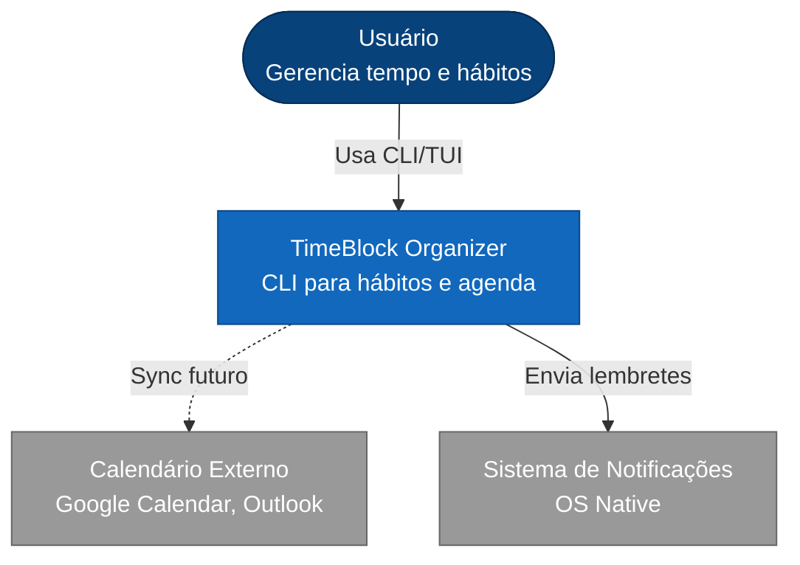

# C4 Level 1: System Context

## Elementos

**Usuário:** Pessoa organizando tempo e cultivando hábitos

**TimeBlock Organizer:** Sistema core (SQLite local-first)

**Calendário Externo:** Sincronização futura com Google Calendar/Outlook via CalDAV

**Sistema de Notificações:** Lembretes via notificações nativas do OS
