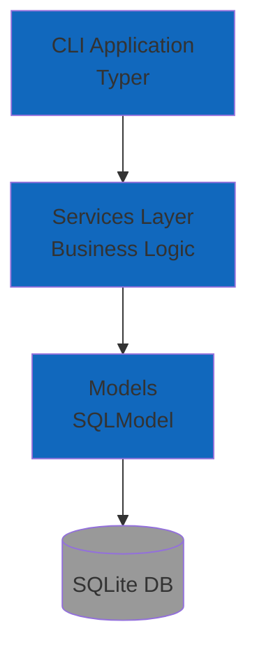

# C4 Level 2: Containers

```mermaid
graph TB
    CLI[CLI Application<br/>Typer]
    Services[Services Layer<br/>Business Logic]
    Models[Models<br/>SQLModel]
    DB[(SQLite DB)]

    CLI --> Services
    Services --> Models
    Models --> DB

    style CLI fill:#1168bd
    style Services fill:#1168bd
    style Models fill:#1168bd
    style DB fill:#999
```
