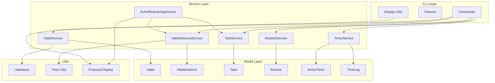

# C4 Level 3: Componentes do Core

- **Versão:** 1.0.0
- **Data:** 31 de Outubro de 2025

---

## Visão Geral

Detalha componentes internos do sistema TimeBlock Organizer.

---

## Diagrama de Componentes



---

## Componentes

### CLI Layer

**Commands** -責任: Interface com usuário

- Tecnologia: Typer
- Dependências: Services

**Parsers** -責任: Parse de argumentos CLI

- Tecnologia: Python stdlib
- Dependências: Validators

**Display Utils** -責任: Formatação de output

- Tecnologia: Rich Console
- Dependências: Models

### Service Layer

**HabitService**

- CRUD de hábitos
- Validação de templates
- Relacionamento com rotinas

**HabitInstanceService**

- Geração de instâncias
- Ajuste de horários
- Transições de estado

**EventReorderingService**

- Detecção de conflitos
- Geração de propostas
- Algoritmo Simple Cascade

**TaskService**

- CRUD de tasks
- Detecção de conflitos
- Integração com reordering

**RoutineService**

- CRUD de rotinas
- Ativação/desativação
- Cancelamento em cascata

**TimerService**

- Controle de timer
- Registro de pausas
- Geração de TimeLog

### Model Layer

**Habit** (Template)

- Definição de hábito recorrente
- Horários planejados
- Tipo de recorrência

**HabitInstance** (Occurrence)

- Instância em data específica
- Estados (PLANNED, IN_PROGRESS, etc)
- Horários reais (actual_start/end)

**Task** (One-time Event)

- Evento único
- Data/hora específicas
- Prioridade

**Routine** (Group)

- Agrupamento de hábitos
- Flag is_active
- Contexto temático

**ActiveTimer**

- Timer em execução
- Pausas registradas
- Vinculado a HabitInstance

**TimeLog**

- Registro histórico
- Tempo executado
- Gerado ao completar

### Utils

**Validators**

- time_range_valid()
- no_overlap()
- date_in_future()

**Time Utils**

- parse_time()
- format_duration()
- calculate_delay()

**Proposal Display**

- format_proposal()
- colorize_conflicts()
- table_changes()

---

## Fluxos de Dados

### Criação de Habit Instance

```terminal
User → CLI Command → HabitInstanceService → Validator
                                          → HabitInstance (Model)
                                          → Database
```

### Detecção de Conflito

```terminal
TaskService.create() → EventReorderingService.detect()
                                            → Query all events
                                            → Calculate overlaps
                                            → Generate proposal
                     ← (Task, Proposal?)
```

### Execução de Timer

```terminal
User → timer start → TimerService → ActiveTimer created
     → timer pause → TimerService → Pause registered
     → timer stop  → TimerService → TimeLog created
                                  → HabitInstance.status = COMPLETED
```

---

## Padrões Arquiteturais

**Service Layer Pattern**

- Business logic em services
- Models são data containers
- Commands são thin wrappers

**Repository Pattern (Implícito)**

- Services encapsulam DB access
- SQLModel ORM abstrai SQL

**Tuple Returns (Deprecated)**

- `(entity, proposal | None)`
- A ser substituído por dataclasses

---

## Dependências Externas

- **Typer** → CLI framework
- **SQLModel** → ORM
- **Rich** → Terminal formatting
- **Pydantic** → Validation
- **Click** → CLI prompts

---

## Testes

### **Unit Tests**

- Models: 45 testes
- Services: 78 testes
- Commands: 33 testes
- Utils: 25 testes

### **Fixtures**

- Database in-memory
- Time freezing (freezegun)
- Factory patterns

---

## Referências

**C4 Model:**

- [L1: System Context](L1-system-context.md)
- [L2: Containers](L2-containers.md)

**API Docs:**

- [Services](../../05-api/services/)
- [Models](../../05-api/models/)

---

**Localização:** `docs/02-diagrams/c4-model/L3-components-core.md`
