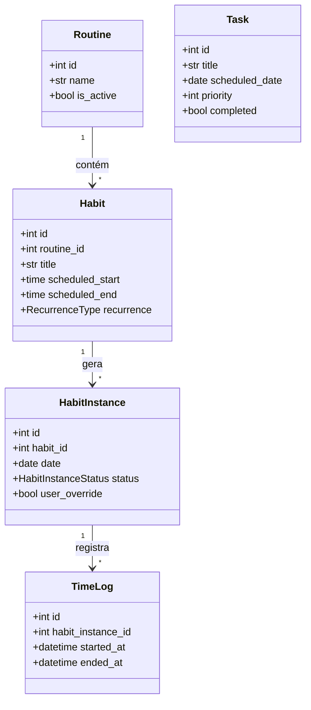

# Diagrama de Classes: Models

- **Versão:** 1.0.0
- **Data:** 31 de Outubro de 2025

**Relacionamentos:**

- Routine → Habit: 1:N (cascade delete)
- Habit → HabitInstance: 1:N (cascade delete)
- HabitInstance → TimeLog: 1:N
