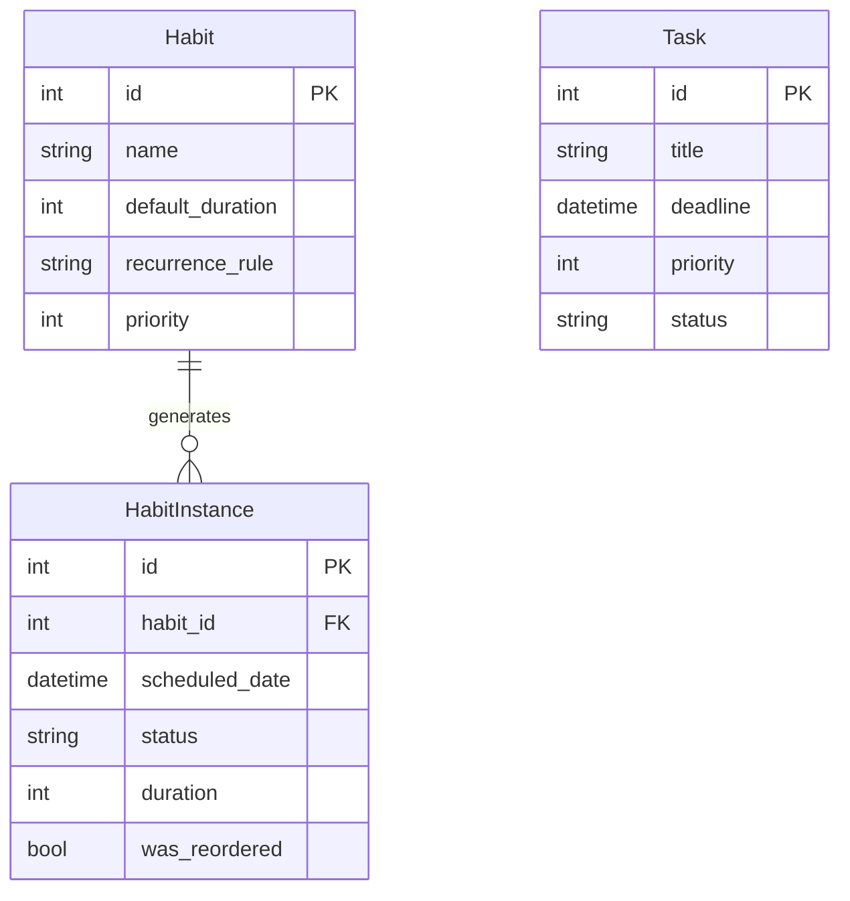

# ER Diagram

```mermaid
erDiagram
    Habit ||--o{ HabitInstance : generates
    Habit {
        int id PK
        string name
        int default_duration
        string recurrence_rule
        int priority
    }
    HabitInstance {
        int id PK
        int habit_id FK
        datetime scheduled_date
        string status
        int duration
        bool was_reordered
    }
    Task {
        int id PK
        string title
        datetime deadline
        int priority
        string status
    }
```
