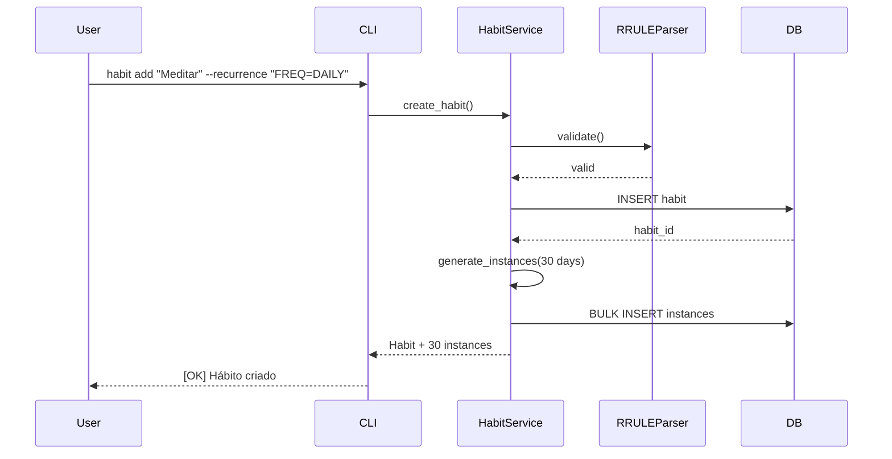

# Sequência: Habit Generation

```mermaid
sequenceDiagram
    User->>CLI: habit add "Meditar" --recurrence "FREQ=DAILY"
    CLI->>HabitService: create_habit()
    HabitService->>RRULEParser: validate()
    RRULEParser-->>HabitService: valid
    HabitService->>DB: INSERT habit
    DB-->>HabitService: habit_id
    HabitService->>HabitService: generate_instances(30 days)
    HabitService->>DB: BULK INSERT instances
    HabitService-->>CLI: Habit + 30 instances
    CLI-->>User: [OK] Hábito criado
```
