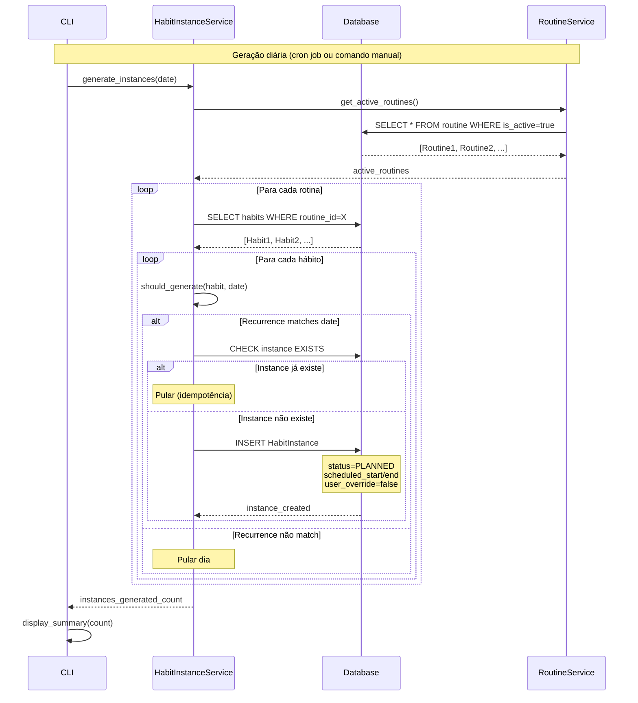
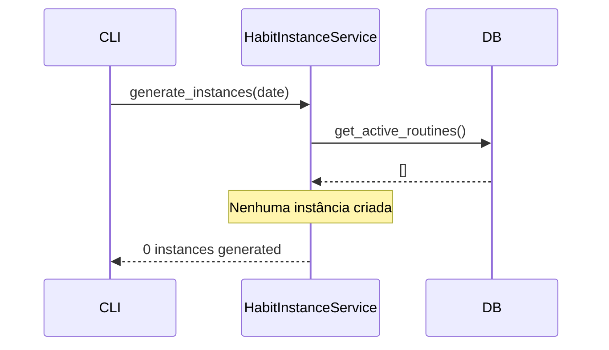
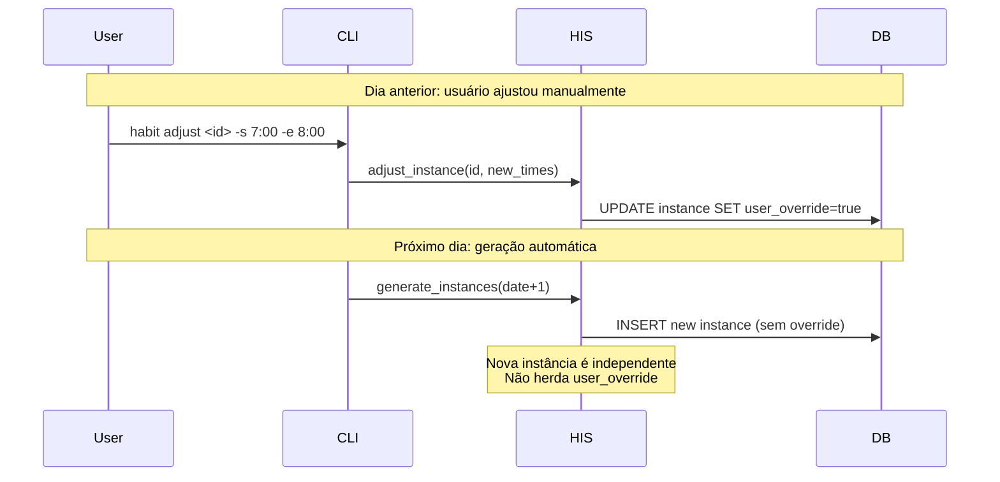

# Diagrama de Sequência: Geração de Instâncias de Hábito

- **Versão:** 1.0.0
- **Data:** 31 de Outubro de 2025

---

## Visão Geral

Documenta o processo de geração automática de `HabitInstance` a partir de templates `Habit`.

---

## Diagrama Principal



---

## Fluxo Detalhado

### 1. Trigger da Geração

**Automático (Produção):**

```shell
# Cron job diário às 00:01
0 1 * * * timeblock habit generate --date tomorrow
```

**Manual (Desenvolvimento):**

```shell
timeblock habit generate --date 2025-11-01
```

### 2. Verificação de Recorrência

```python
def should_generate(habit: Habit, target_date: date) -> bool:
    """Verifica se hábito deve gerar instância para data."""

    # DAILY sempre gera
    if habit.recurrence == RecurrenceType.DAILY:
        return True

    # Dias específicos verificam weekday
    weekday = target_date.weekday()  # 0=Monday, 6=Sunday

    recurrence_map = {
        RecurrenceType.MONDAY: 0,
        RecurrenceType.TUESDAY: 1,
        RecurrenceType.WEDNESDAY: 2,
        RecurrenceType.THURSDAY: 3,
        RecurrenceType.FRIDAY: 4,
        RecurrenceType.SATURDAY: 5,
        RecurrenceType.SUNDAY: 6
    }

    return recurrence_map.get(habit.recurrence) == weekday
```

### 3. Idempotência

```python
def generate_instance_safe(habit: Habit, date: date) -> HabitInstance | None:
    """Gera instância se não existir (idempotente)."""

    # Verificar existência
    existing = session.exec(
        select(HabitInstance)
        .where(HabitInstance.habit_id == habit.id)
        .where(HabitInstance.date == date)
    ).first()

    if existing:
        return None  # Já existe, pular

    # Criar nova
    instance = HabitInstance(
        habit_id=habit.id,
        date=date,
        scheduled_start=habit.scheduled_start,
        scheduled_end=habit.scheduled_end,
        status=HabitInstanceStatus.PLANNED,
        user_override=False
    )

    session.add(instance)
    session.commit()
    return instance
```

---

## Casos Especiais

### Rotina Desativada



### Instância com User Override



---

## Regras de Negócio

**RN-037:** Sistema gera instâncias automaticamente para datas futuras
**RN-038:** Instâncias criadas em estado PLANNED
**RN-039:** Geração é idempotente (executar 2x não duplica)
**RN-040:** Apenas rotinas ativas geram instâncias

---

## Performance

### Otimizações

**Batch Insert:**

```python
instances_to_create = []

for habit in habits:
    if should_generate(habit, date):
        instances_to_create.append(
            HabitInstance(...)
        )

session.bulk_save_objects(instances_to_create)
session.commit()
```

**Complexidade:**

- Tempo: O(R × H × D) onde R=rotinas, H=hábitos/rotina, D=dias
- Para geração mensal: ~10 rotinas × 5 hábitos × 30 dias = 1500 instâncias
- Execução: < 1 segundo

---

## Testes

```python
def test_generate_daily_habit():
    """DAILY gera instância todo dia."""
    habit = create_habit(recurrence=RecurrenceType.DAILY)

    count = HabitInstanceService.generate(date(2025, 11, 1))

    assert count == 1
    instance = get_instance(habit.id, date(2025, 11, 1))
    assert instance.status == HabitInstanceStatus.PLANNED

def test_generate_monday_only():
    """MONDAY gera apenas às segundas."""
    habit = create_habit(recurrence=RecurrenceType.MONDAY)

    # Segunda (2025-11-03)
    count_mon = HabitInstanceService.generate(date(2025, 11, 3))
    assert count_mon == 1

    # Terça (2025-11-04)
    count_tue = HabitInstanceService.generate(date(2025, 11, 4))
    assert count_tue == 0

def test_idempotent_generation():
    """Gerar 2x não duplica."""
    habit = create_habit(recurrence=RecurrenceType.DAILY)
    target = date(2025, 11, 1)

    count1 = HabitInstanceService.generate(target)
    count2 = HabitInstanceService.generate(target)

    assert count1 == 1
    assert count2 == 0  # Já existe

    instances = get_all_instances(habit.id, target)
    assert len(instances) == 1
```

---

## Referências

**Models:**

- [Habit](../../05-api/models/habit.md)
- [HabitInstance](../../05-api/models/habit-instance.md)

**Services:**

- [HabitInstanceService](../../05-api/services/habit-service.md)

**Business Rules:**

- [BR001: Habit Scheduling](../../04-specifications/business-rules/BR001-habit-scheduling.md)

---

**Localização:** `docs/02-diagrams/sequences/habit-instantiation.md`
