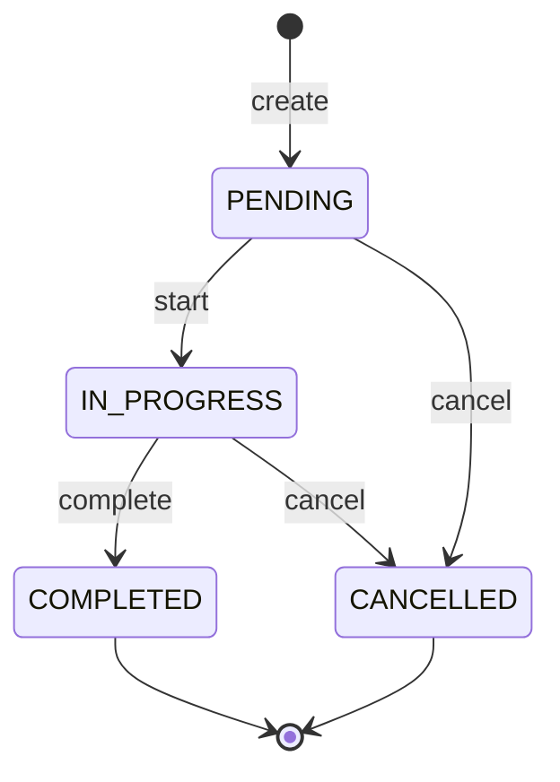

# Estados: Task Lifecycle

```mermaid
stateDiagram-v2
    [*] --> PENDING: create
    PENDING --> IN_PROGRESS: start
    PENDING --> CANCELLED: cancel
    IN_PROGRESS --> COMPLETED: complete
    IN_PROGRESS --> CANCELLED: cancel
    COMPLETED --> [*]
    CANCELLED --> [*]
```
