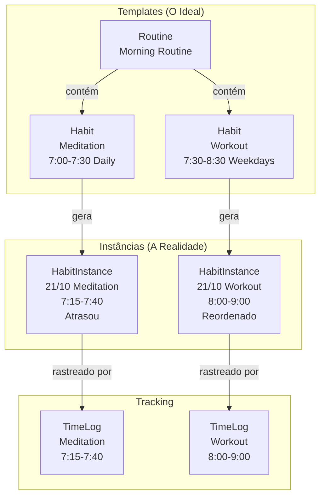
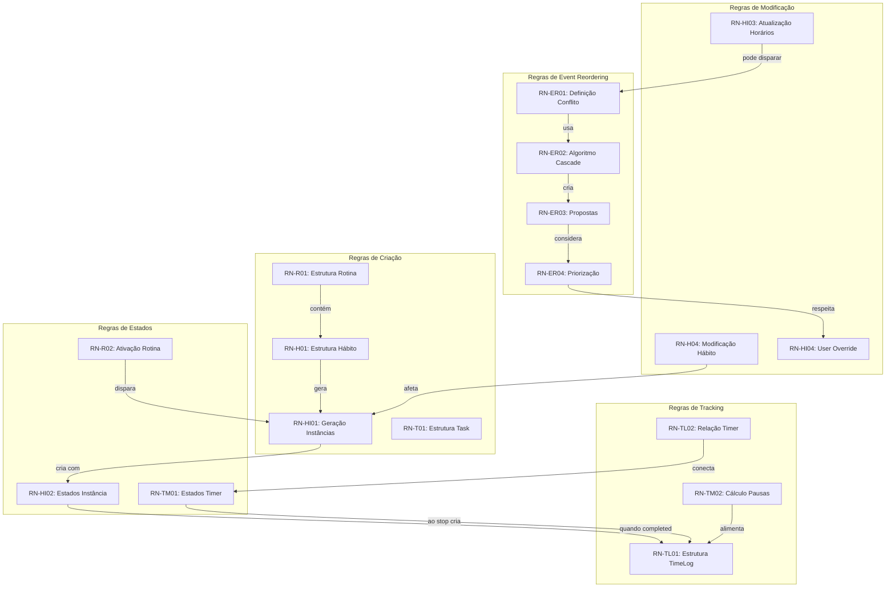

# Regras de Negócio - TimeBlock Organizer

**Versão**: 2.0.0
**Data**: 27 de Outubro de 2025
**Propósito**: Documentar todas as regras de negócio que governam o comportamento do sistema

---

## Índice

1. [Introdução e Fundamentos](#introducao-e-fundamentos)
2. [Domínio: Time Blocking](#dominio-time-blocking)
3. [Regras de Rotinas](#regras-de-rotinas-routines)
4. [Regras de Hábitos](#regras-de-habitos-habits)
5. [Regras de Instâncias](#regras-de-instancias-habitinstances)
6. [Regras de Tarefas](#regras-de-tarefas-tasks)
7. [Regras de Time Logs](#regras-de-time-logs)
8. [Regras de Tags](#regras-de-tags)
9. [Regras de Event Reordering](#regras-de-event-reordering)
10. [Regras de Timers](#regras-de-timers)
11. [Regras de Validação Global](#regras-de-validacao-global)
12. [Regras de Priorização](#regras-de-priorizacao)

---

## Introdução e Fundamentos

### O Que São Regras de Negócio?

Regras de negócio são as políticas, restrições e lógicas que definem como o sistema deve se comportar. No TimeBlock Organizer, definem:

- **O que é permitido**: Quais operações são válidas
- **O que é obrigatório**: Quais campos/operações são mandatórios
- **Como o sistema reage**: Comportamento automático em resposta a eventos
- **O que é calculado**: Derivações automáticas de informação
- **Como conflitos são resolvidos**: Lógica de resolução de inconsistências

### Hierarquia de Regras

#### **Nível 1: Regras Estruturais (Sempre Aplicadas)**

- Garantem integridade estrutural do sistema
- Violá-las torna o sistema inconsistente
- Exemplo: "Todo HabitInstance deve ter um Habit pai"

#### **Nível 2: Regras de Domínio (Aplicadas em Operações Normais)**

- Implementam a lógica de time blocking
- Podem ser sobrescritas em casos especiais com justificativa
- Exemplo: "Eventos não devem conflitar"

#### **Nível 3: Regras de Preferência (Sugestões)**

- Guiam comportamento padrão mas podem ser facilmente ignoradas
- Exemplo: "Sugerir cor padrão baseada em categoria"

### Princípios Fundamentais

**Princípio da Adaptabilidade**: O sistema se adapta à realidade do usuário. Quando algo atrasa, reorganiza automaticamente.

**Princípio da Preservação de Intenção**: Mudanças automáticas preservam a intenção original. Se usuário planejou 30min de meditação, a duração é mantida mesmo que o horário mude.

**Princípio da Transparência**: Toda mudança automática deve ser explicável e reversível. O usuário sempre tem controle final.

**Princípio da Simplicidade Progressiva**: Funcionalidade básica simples, sofisticação quando necessário.

---

## Domínio: Time Blocking

### Conceitos Fundamentais

**Evento (Event)**: Qualquer bloco de tempo na agenda. Pode ser Habit, HabitInstance ou Task.

**Rotina (Routine)**: Template semanal que agrupa hábitos relacionados.

**Hábito (Habit)**: Evento recorrente, template que define "o que deveria acontecer idealmente".

**Instância de Hábito (HabitInstance)**: Ocorrência real de um hábito em data específica, registra "o que realmente aconteceu".

**Tarefa (Task)**: Evento pontual não-recorrente.

**Time Log**: Registro de tempo efetivamente gasto, com pausas.

**Conflito**: Dois eventos ocupam o mesmo intervalo de tempo.

**Event Reordering**: Processo automático de reorganizar eventos quando um atrasa.

### Diagrama Conceitual



---

## Regras de Rotinas (Routines)

### RN-R01: Estrutura de Rotina

**Regra**: Uma Rotina é um agrupamento lógico de Hábitos relacionados que compartilham contexto temporal ou temático.

**Invariantes**:

- Toda Rotina deve ter nome único e não-vazio
- Rotina pode conter zero ou mais Hábitos
- Flag `is_active` determina se Hábitos geram instâncias

**Exemplo Válido**:

```python
routine = Routine(name="Morning Routine", is_active=True)
```

**Exemplo Inválido**:

```python
routine = Routine(name="", is_active=True)  # Nome vazio
routine = Routine(name=None, is_active=True)  # Nome None
```

### RN-R02: Ativação de Rotina

**Regra**: Quando Rotina é ativada (`is_active=True`), todos Hábitos devem ter instâncias geradas para horizonte de planejamento (8 semanas).

**Comportamento**:

1. Ao ativar rotina, sistema itera sobre todos Hábitos
2. Para cada Habit, gera instâncias das próximas 8 semanas
3. Instâncias respeitam regras de recorrência

**Invariantes**:

- Rotina inativa não gera novas instâncias automaticamente
- Ativar rotina é operação idempotente

**Exemplo**:

```python
routine = RoutineService.create_routine(session, name="Morning Routine")
habit1 = HabitService.create_habit(session, routine_id=routine.id, ...)

RoutineService.activate(session, routine.id)
instances = HabitInstanceService.get_by_habit(session, habit1.id)
assert len(instances) == 56  # 8 semanas x 7 dias (se diário)
```

### RN-R03: Desativação de Rotina

**Regra**: Quando Rotina é desativada, instâncias futuras (não iniciadas) são marcadas como canceladas, mas instâncias completadas são preservadas.

**Comportamento**:

1. Sistema identifica instâncias com status "planned"
2. Marca como "cancelled"
3. Instâncias "in_progress", "completed", "skipped" não são afetadas

**Invariantes**:

- Histórico não é destruído
- Reativar rotina gera novas instâncias

### RN-R04: Unicidade de Nome

**Regra**: Não podem existir duas Rotinas com mesmo nome (case-insensitive).

**Validação**: Antes de criar/renomear, verificar se já existe rotina com aquele nome.

---

## Regras de Hábitos (Habits)

### RN-H01: Estrutura de Hábito

**Regra**: Hábito é template de evento recorrente vinculado a Rotina.

**Campos Obrigatórios**:

- `routine_id`: FK para Routine

- `title`: Nome do hábito (não-vazio)

- `scheduled_start_time`: Horário ideal de início

- `scheduled_duration_minutes`: Duração planejada (> 0)

- `recurrence`: Padrão de recorrência (Enum)

**Invariantes**:

- `scheduled_duration_minutes > 0`

- Se `scheduled_end_time` fornecido, deve ser posterior a `scheduled_start_time`

- `recurrence` deve ser valor válido

### RN-H02: Cálculo Automático de End Time

**Regra**: Se `scheduled_end_time` não fornecido, calcular como `scheduled_start_time + scheduled_duration_minutes`.

**Exemplo**:

```python
habit = Habit(
    scheduled_start_time=time(7, 0),
    scheduled_duration_minutes=30
)
assert habit.scheduled_end_time == time(7, 30)
```

### RN-H03: Regras de Recorrência

**Padrões Suportados**:

**EVERYDAY**: Todos os dias (seg-dom) - 7 instâncias/semana

**WEEKDAYS**: Dias úteis (seg-sex) - 5 instâncias/semana

**WEEKENDS**: Fins de semana (sáb-dom) - 2 instâncias/semana

**WEEKLY_ON**: Dias específicos - requer `recurrence_days=[0,2,4]` (seg/qua/sex)

**Invariantes**:

- Se `recurrence=WEEKLY_ON`, campo `recurrence_days` deve estar presente e não-vazio

- `recurrence_days` só é válido se `recurrence=WEEKLY_ON`

### RN-H04: Modificação de Hábito

**Regra**: Quando Hábito é modificado, apenas instâncias futuras (não iniciadas) são afetadas. Instâncias passadas preservam valores originais.

**Comportamento**:

1. Usuário modifica Habit (ex: muda horário de 7h para 7:30)
2. Sistema identifica instâncias com status "planned" e date >= hoje
3. Atualiza essas instâncias
4. Instâncias completadas/em progresso não mudam

**Exemplo**:

```python
# Segunda - instância completada às 7:00
instance_mon = get_instance(date(2025, 10, 21))
assert instance_mon.status == "completed"

# Terça - instância planejada
instance_tue = get_instance(date(2025, 10, 22))
assert instance_tue.status == "planned"

# Muda Habit para 7:30
HabitService.update_habit(session, habit.id, scheduled_start_time=time(7, 30))

# Segunda não muda (já completada)
assert instance_mon.actual_start_time == time(7, 0)

# Terça atualizada
assert instance_tue.scheduled_start_time == time(7, 30)
```

### RN-H05: Deleção de Hábito

**Regra**: Deletar Hábito é soft-delete. Registro marcado como `deleted=True`.

**Comportamento**:

1. Sistema marca `habit.deleted=True`
2. Instâncias futuras marcadas como "cancelled"
3. Instâncias passadas preservadas
4. Habit não aparece em listagens

---

## Regras de Instâncias (HabitInstances)

### RN-HI01: Geração de Instâncias

**Regra**: Instâncias geradas automaticamente a partir de Hábitos ativos no horizonte de 8 semanas.

**Processo**:

1. Para cada Habit da Routine ativa
2. Calcula datas dos próximos 56 dias
3. Para cada data, verifica se Habit deve ocorrer (baseado em recurrence)
4. Se sim, cria HabitInstance

**Campos Copiados**:

- `scheduled_start_time`, `scheduled_end_time`, `scheduled_duration_minutes`

- `title`, `description`, `color`, `icon`

**Campos Específicos**:

- `date`: Data específica desta ocorrência

- `status`: Sempre inicia como "planned"

- `user_override`: Sempre inicia como False

### RN-HI02: Estados de Instância

**Estados Possíveis**:

**PLANNED** (Inicial) - Instância gerada, usuário não interagiu

**IN_PROGRESS** (Durante Execução) - Usuário iniciou mas não completou

**COMPLETED** (Completada) - Usuário completou a atividade

**SKIPPED** (Pulada) - Usuário decidiu não fazer

**CANCELLED** (Cancelada) - Sistema cancelou (rotina desativada)

**Transições Permitidas**:

```terminal
PLANNED -> IN_PROGRESS -> COMPLETED
PLANNED -> SKIPPED
PLANNED -> CANCELLED
IN_PROGRESS -> COMPLETED
IN_PROGRESS -> SKIPPED
```

**Transições Proibidas**:

- COMPLETED -> qualquer (irreversível)
- CANCELLED -> qualquer (irreversível)
- SKIPPED -> IN_PROGRESS (não pode "despular")

### RN-HI03: Atualização de Horários Reais

**Regra**: Quando usuário inicia HabitInstance, `actual_start_time` é setado. Quando completa, `actual_end_time` é setado.

**Exemplo**:

```python
# Planejada para 7:00
instance = HabitInstance(scheduled_start_time=time(7, 0), status="planned")

# Usuário inicia às 7:15 (atrasou)
HabitInstanceService.start(session, instance.id)
# status = "in_progress"
# actual_start_time = time(7, 15)

# Completa às 7:40
HabitInstanceService.complete(session, instance.id)
# status = "completed"
# actual_end_time = time(7, 40)
```

**Invariantes**:

- `actual_end_time` nunca pode ser anterior a `actual_start_time`

- Se `actual_start_time != scheduled_start_time`, pode disparar Event Reordering

### RN-HI04: User Override Flag

**Regra**: Flag `user_override=True` indica que usuário modificou horários manualmente. Instância não segue mais automaticamente mudanças do Habit template.

**Casos que Setam user_override=True**:

1. Usuário move horário da instância manualmente
2. Usuário muda duração da instância
3. Usuário aceita proposta de Event Reordering

**Exemplo**:

```python
instance = HabitInstance(scheduled_start_time=time(7, 0))
assert instance.user_override == False

# Usuário move para 8:00
HabitInstanceService.update_time(session, instance.id, new_time=time(8, 0))
assert instance.user_override == True

# Habit template muda para 7:30, mas instância fica em 8:00
HabitService.update_habit(session, habit.id, scheduled_start_time=time(7, 30))
assert instance.scheduled_start_time == time(8, 0)  # Não mudou
```

### RN-HI05: Geração Contínua

**Regra**: Sistema mantém sempre horizonte de 8 semanas. Quando semana atual termina, gera instâncias para 9ª semana.

**Comportamento**:

- Job diário verifica se horizonte < 8 semanas
- Gera instâncias faltantes
- Processo incremental e idempotente

---

## Regras de Tarefas (Tasks)

### RN-T01: Estrutura de Task

**Regra**: Task é evento pontual não-recorrente com data e horário específicos.

**Diferença de Habit**: Habit é template recorrente. Task é evento único.

**Campos Obrigatórios**:

- `title`, `scheduled_date`, `scheduled_start_time`, `scheduled_duration_minutes`

**Campos Opcionais**:

- `description`, `priority`, `tags`, `is_completed`

### RN-T02: Checklist de Task

**Regra**: Task pode ser marcada como completada independente de haver TimeLog associado.

**Diferença de HabitInstance**: Task tem apenas `is_completed` boolean.

### RN-T03: Interação com Event Reordering

**Regra**: Tasks participam de detecção de conflitos e podem ser reordenadas.

---

## Regras de Time Logs

### RN-TL01: Estrutura de TimeLog

**Regra**: TimeLog registra tempo efetivamente gasto, incluindo pausas.

**Campos Obrigatórios**:

- `entity_type`: 'habit_instance' ou 'task'

- `entity_id`: FK para HabitInstance ou Task

- `actual_start_time`, `actual_end_time`

**Campos de Pausas**:

- `pause_count`, `total_pause_duration_seconds`

**Campos Calculados**:

- `effective_duration_seconds = (end - start) - pause_duration`

### RN-TL02: Relação com Timer

**Regra**: TimeLog é criado automaticamente quando Timer é finalizado.

**Fluxo**:

1. Timer registra start_time
2. Pausas/resumes (opcional)
3. Timer para
4. Sistema cria TimeLog com dados coletados

---

## Regras de Tags

### RN-TAG01: Estrutura de Tag

**Regra**: Tag é label categórica anexável a Habits, Tasks ou Routines.

**Campos**: `name` (único), `color` (opcional)

### RN-TAG02: Many-to-Many

**Regra**: Relação many-to-many entre Tags e entidades via tabelas de junção.

---

## Regras de Event Reordering

### RN-ER01: Definição de Conflito

**Regra**: Conflito ocorre quando dois eventos têm sobreposição temporal no mesmo dia.

**Detecção Formal**:
Sejam Event A e Event B no mesmo dia:

- A: [T1, T2]
- B: [T3, T4]

Conflito existe se: `(T1 < T4) AND (T3 < T2)`

**Tolerância**: 1 minuto de sobreposição não é conflito.

**Exemplo**:

```python
# Evento A: 12:00-13:00
# Evento B: 12:30-13:30
# Sobreposição: 12:30-13:00 (30min) -> CONFLITO

# Evento C: 13:00-14:00
# Não conflita com A (adjacente)
```

### RN-ER02: Algoritmo de Reordenação (Simple Cascade)

**Regra**: Quando evento atrasa ΔT minutos, todos subsequentes são shiftados em ΔT, preservando intervalos.

**Algoritmo**:

```terminal
ENTRADA: evento E que atrasou, novo horário real, lista eventos do dia

1. Calcular ΔT = (novo_horário - horário_planejado)
2. Ordenar eventos por start_time
3. Encontrar posição de E
4. Para cada evento subsequente S:
   4.1. novo_start(S) = atual_start(S) + ΔT
   4.2. novo_end(S) = atual_end(S) + ΔT
   4.3. Criar ProposedChange para S
5. Retornar ReorderingProposal

SAÍDA: ReorderingProposal com lista de ProposedChanges
```

**Exemplo**:

```python
# Agenda original:
# 07:00-07:30 Meditation
# 07:30-08:30 Workout
# 08:30-09:00 Breakfast
# 09:00-10:00 Work

# Meditation atrasa 15min (começa às 7:15)
# Proposta:
# - Workout: 07:30->07:45, 08:30->08:45 (+15min)
# - Breakfast: 08:30->08:45, 09:00->09:15 (+15min)
# - Work: 09:00->09:15, 10:00->10:15 (+15min)
```

### RN-ER03: Propostas, Não Aplicação Automática

**Regra**: Event Reordering **propõe** mudanças mas **não aplica automaticamente**. Usuário deve aceitar ou rejeitar.

**Fluxo**:

1. Conflito detectado
2. Sistema gera ReorderingProposal
3. CLI exibe proposta (tabela antes/depois)
4. Usuário aceita ou rejeita
5. Se aceito, mudanças aplicadas transacionalmente

### RN-ER04: Priorização de Eventos

**Hierarquia**:

**Prioridade 1 (Imóvel)**: Eventos com `user_override=True`

**Prioridade 2 (Preferencial)**: Tasks com `priority=URGENT`

**Prioridade 3 (Normal)**: HabitInstances regulares

**Prioridade 4 (Flexível)**: HabitInstances com `is_optional=True`

### RN-ER05: Boundary Checks

**Validações**:

1. **Meia-Noite**: Evento não pode terminar após 23:59
2. **Manhã Cedo**: Avisar se evento antes das 6:00
3. **Duração Total**: Avisar se soma exceder 16 horas

**Comportamento**: Violação gera warning mas não impede aceitação.

### RN-ER06: Transacionalidade

**Regra**: Aplicar ReorderingProposal é operação transacional all-or-nothing.

**Comportamento**: Ou todas mudanças aplicam ou nenhuma (rollback).

---

## Regras de Timers

### RN-TM01: Estados de Timer

**Estados**: Running, Paused, Stopped

**Transições**:

```terminal
[START] -> Running
Running -> [PAUSE] -> Paused
Paused -> [RESUME] -> Running
Running -> [STOP] -> Stopped (cria TimeLog)
Paused -> [STOP] -> Stopped (cria TimeLog)
```

**Invariantes**:

- Apenas um timer Running por vez
- Timer Stopped não pode ser resumido

### RN-TM02: Cálculo de Pausas

**Regra**: Quando timer é pausado e resumido, sistema registra duração da pausa.

**Implementação**:

```python
class Timer:
    start_time: datetime
    pause_start: Optional[datetime]
    pauses: List[Tuple[datetime, datetime]]

    def pause(self):
        self.pause_start = datetime.now()

    def resume(self):
        if self.pause_start:
            pause_end = datetime.now()
            self.pauses.append((self.pause_start, pause_end))
            self.pause_start = None

    def stop(self) -> TimeLog:
        end_time = datetime.now()
        total_pause = sum((end - start).seconds for start, end in self.pauses)
        return TimeLog(
            actual_start_time=self.start_time,
            actual_end_time=end_time,
            pause_count=len(self.pauses),
            total_pause_duration_seconds=total_pause
        )
```

---

## Regras de Validação Global

### RN-VAL01: Validação de Horários

**Regras**:

1. `start_time < end_time`
2. `duration_minutes > 0`
3. `duration_minutes = (end_time - start_time) em minutos`
4. Horários dentro do dia (00:00 - 23:59)

### RN-VAL02: Validação de Datas

**Regras**:

1. Data não anterior a 2020-01-01
2. Data não posterior a hoje + 1 ano
3. Formato ISO 8601

### RN-VAL03: Validação de Strings

**Limites**:

- `title`: 1-200 caracteres

- `description`: 0-2000 caracteres

- `name`: 1-100 caracteres

---

## Regras de Priorização

### RN-PRIO01: Ordem de Execução

**Critério de Desempate** (quando múltiplos eventos no mesmo horário):

1. Priority (URGENT > HIGH > MEDIUM > LOW)
2. Tipo (Task > HabitInstance)
3. Ordem de criação (mais antigo primeiro)

---

## Diagrama de Regras de Negócio



---

## Conclusão

Este documento captura todas as **33 regras de negócio** fundamentais do TimeBlock Organizer. Estas regras devem:

- **Guiar Implementação**: Cada regra deve ter correspondência no código
- **Informar Testes**: Para cada regra, deve existir teste validando comportamento
- **Fundamentar Docstrings**: Docstrings devem referenciar regras relevantes
- **Evoluir com Sistema**: Atualizar este documento com novas regras
- **Ser Single Source of Truth**: Referência autoritativa para comportamento esperado

---

**Documento criado**: 27 de Outubro de 2025
**Versão**: 2.0.0
**Próxima revisão**: Após implementação TUI (v2.1)
