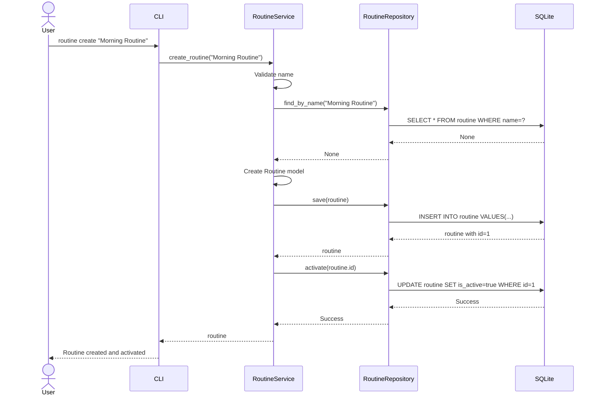
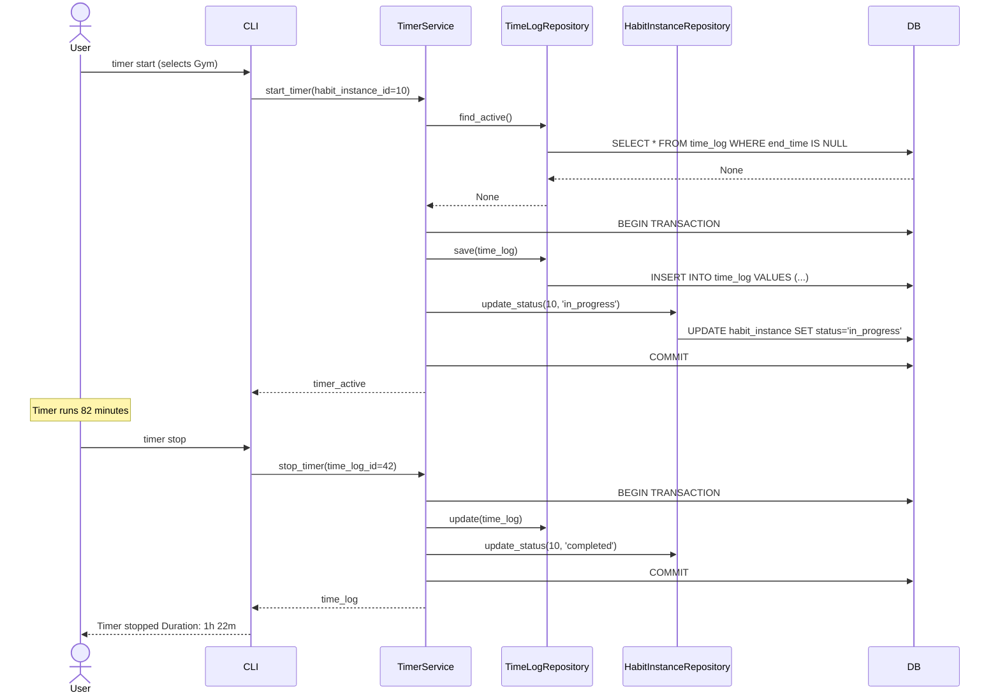

# Análise Arquitetural Completa

**Versão**: 2.0
**Data**: 21 de Outubro de 2025

---

## Inferências sobre Arquitetura

### Influência de Domain-Driven Design

Projeto demonstra forte influência de princípios DDD através da separação clara entre entities, services e repositories. Estrutura de packages e nomeação sugerem familiaridade com estes conceitos.

### Evolução para Web

Ausência de camada API REST/GraphQL sugere concepção inicial como ferramenta pessoal, mas escolha de Textual indica intenção futura de deployment web.

### Type Safety e Validação

Uso extensivo de type hints e Pydantic indica preferência por type safety. Validação em tempo de compilação (mypy) e runtime (Pydantic) cria múltiplas camadas de defesa.

### Preferência por Simplicidade

Escolha de não usar framework pesado como Django demonstra valorização de simplicidade. Projeto compõe bibliotecas focadas (Typer, Rich, SQLModel).

### Modularidade e Navegabilidade

Padrão de manter arquivos pequenos (~100 linhas) revela preferência por componentes focados.

### Cultura de Testes

Estrutura de testes bem organizada com separação unit/integration/e2e demonstra cultura de qualidade. Meta de 95% de cobertura mostra comprometimento.

---

## Diagramas de Sequência Detalhados

### 1. Criar e Ativar Rotina

### 2. Timer Completo

---

**Documento criado**: 21 de Outubro de 2025
**Versão**: 2.0
