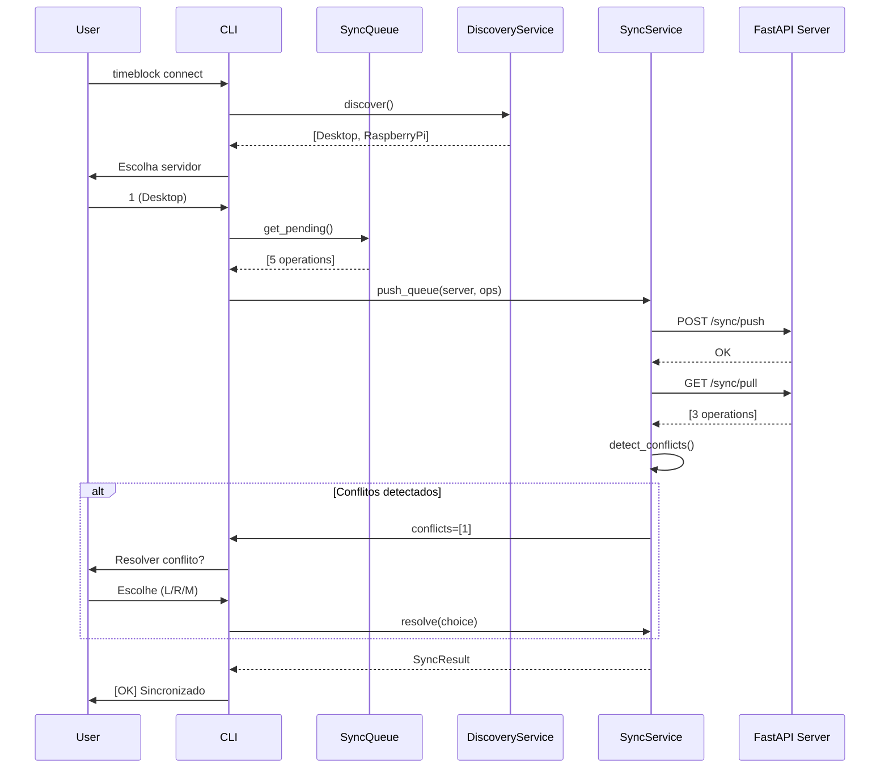

# 16. Sync Architecture (v2.0)

**Status:** Planejado

**Timeline:** Nov 2025 - Ago 2026

**Relacionado:** ADR-012, ADR-013, ADR-014

## Visão Geral

Arquitetura de sincronização offline-first entre dispositivos Linux e Android (Termux), mantendo princípios local-first do TimeBlock.

### Objetivos

1. **Offline-first:** Funcionar perfeitamente sem conexão
2. **Simplicidade:** Zero configuração, discovery automático
3. **Controle:** Usuário decide quando sincronizar
4. **Confiabilidade:** Resolução clara de conflitos
5. **Performance:** Sincronização rápida (<5s para 100 ops)

## Decisões Arquiteturais

### ADR-012: Queue-Based Sync

**Decisão:** Sincronização explícita via comando `timeblock connect`

**Alternativas rejeitadas:**

- Daemon auto-sync (complexo, overhead)
- Syncthing + SQLite (risco de corrupção)
- API-only (requer internet sempre)

**Consequências:**

- [+] Zero overhead quando offline
- [+] Fácil debug (inspect queue)
- [+] Battery-friendly
- [-] Requer ação manual

### ADR-013: Offline-First Schema

**Decisão:** Migração INT → UUID + 6 campos metadata

**Breaking change:**

```python
# Antes (v1.x)
class Habit(SQLModel):
    id: int = Field(primary_key=True)  # AUTO-INCREMENT

# Depois (v2.0)
class Habit(SQLModel):
    id: UUID = Field(default_factory=uuid4, primary_key=True)
    created_at: datetime
    updated_at: datetime
    synced_at: datetime | None
    device_id: UUID
    deleted: bool = False
    sync_version: int = 1
```

**Migration strategy:** Alembic migration com validação extensiva

### ADR-014: Connect Paradigm

**Decisão:** Comando amigável com discovery automático

```bash
$ timeblock connect
Descobrindo servidores...
1. Desktop (192.168.1.10)
2. Raspberry Pi (192.168.1.50)
Escolha: 1

Sincronizando... [========================================] 100%
[OK] 5 operações enviadas
[OK] 3 operações recebidas
[WARN] 1 conflito detectado
```

## Componentes

### 1. SyncQueue

**Responsabilidade:** Persistir operações offline

```python
class SyncQueue:
    def add(self, operation: SyncOperation) -> None:
        """Adiciona operação à fila"""

    def get_pending(self) -> List[SyncOperation]:
        """Retorna operações não sincronizadas"""

    def mark_synced(self, op_id: UUID) -> None:
        """Marca operação como sincronizada"""
```

**Persistência:** `~/.timeblock/sync_queue.json`

```json
{
  "operations": [
    {
      "id": "uuid-here",
      "type": "CREATE",
      "entity": "Habit",
      "data": {...},
      "timestamp": "2025-11-05T10:30:00Z",
      "device_id": "uuid-device"
    }
  ]
}
```

### 2. DiscoveryService

**Responsabilidade:** Descobrir servidores na rede local

```python
class DiscoveryService:
    def discover(self, timeout: int = 5) -> List[Server]:
        """Usa mDNS/Zeroconf para encontrar servidores"""

    def announce(self, port: int = 8000) -> None:
        """Anuncia servidor na rede"""
```

**Protocolo:** mDNS com service type `_timeblock._tcp`

### 3. SyncService

**Responsabilidade:** Coordenar sincronização

```python
class SyncService:
    def connect(self, server: Server) -> SyncResult:
        """Executa sincronização completa"""

    def push_queue(self) -> int:
        """Envia operações pendentes"""

    def pull_changes(self) -> int:
        """Recebe mudanças remotas"""

    def detect_conflicts(self) -> List[Conflict]:
        """Identifica conflitos"""

    def resolve_conflicts(self, strategy: str) -> None:
        """Resolve conflitos (interativo ou auto)"""
```

### 4. FastAPI Server

**Responsabilidade:** Receber conexões sync

```python
# api/main.py
@app.post("/sync/push")
async def push_operations(ops: List[SyncOperation]):
    """Recebe operações de clientes"""

@app.get("/sync/pull")
async def pull_operations(since: datetime):
    """Envia operações para clientes"""

@app.post("/sync/conflicts")
async def report_conflicts(conflicts: List[Conflict]):
    """Recebe resolução de conflitos"""
```

## Fluxo de Sincronização



## Conflict Resolution

### Estratégias

**1. Last-Write-Wins (padrão):**

```python
if local.updated_at > remote.updated_at:
    keep_local()
else:
    keep_remote()
```

**2. Interativa:**

```bash
Conflito: Habit "Leitura"
Local:  21:00 - 21:30 (updated 10:30)
Remote: 22:00 - 22:30 (updated 10:35)

Escolha:
[L] Manter local
[R] Usar remoto
[M] Merge manual
```

**3. Auto-resolve (--auto-approve):**

- Sempre usa last-write-wins
- Log detalhado de decisões

### Tipos de Conflito

```python
@dataclass
class Conflict:
    entity_type: str  # "Habit", "Task", etc
    entity_id: UUID
    field: str
    local_value: Any
    remote_value: Any
    local_updated: datetime
    remote_updated: datetime
```

## Deployment

### Server (Raspberry Pi)

```bash
# Iniciar servidor
timeblock server start --port 8000

# Logs
[INFO] Server listening on 0.0.0.0:8000
[INFO] mDNS announced as "timeblock-rpi"
[INFO] Ready for connections
```

**Requisitos:**

- Python 3.13+
- FastAPI + Uvicorn
- python-zeroconf

### Client (Linux/Android)

```bash
# Uso normal offline
timeblock habit create "Leitura" --time 21:00

# Sincronizar quando disponível
timeblock connect

# Auto-connect se único servidor
timeblock connect --auto
```

## Métricas de Sucesso

### v1.3.0 (Infraestrutura)

- Migration sucesso: 100% em 1000 DBs teste
- Zero data loss
- Query performance delta <10%

### v2.0-alpha (MVP)

- Connect funciona: 100%
- Sync 100 ops: <5s
- Discovery success: >95%

### v2.0-stable (Produção)

- Sync success rate: >98%
- Conflict rate: <5%
- User adoption: >1x por dia

## Riscos e Mitigações

| Risco                | Impacto | Probabilidade | Mitigação                   |
| -------------------- | ------- | ------------- | --------------------------- |
| Migration falha      | ALTO    | MÉDIO         | Backup automático, rollback |
| mDNS não funciona    | MÉDIO   | BAIXO         | Fallback IP manual          |
| Conflitos frequentes | MÉDIO   | MÉDIO         | UX clara, logs detalhados   |
| Performance ruim     | BAIXO   | BAIXO         | Sync incremental, batch ops |

## Roadmap de Implementação

### Fase 1: Infraestrutura (v1.3.0) - 3 meses

- Sprint 1.3.1: Models migration
- Sprint 1.3.2: Services update
- Sprint 1.3.3: Sync services
- Sprint 1.3.4: E2E tests
- Sprint 1.3.5: Documentation

### Fase 2: MVP (v2.0-alpha) - 2 meses

- Sprint 2.0.1: Connect command
- Sprint 2.0.2: FastAPI server
- Sprint 2.0.3: Conflict resolution
- Sprint 2.0.4: E2E complete

### Fase 3: Enhanced (v2.0-beta) - 2 meses

- Dashboard TUI
- Healthcheck
- Error recovery

### Fase 4: Produção (v2.0-stable) - 2 meses

- Docker deployment
- Monitoring
- Security audit

## Referências

### ADRs

- [ADR-012: Sync Strategy](../03-decisions/012-sync-strategy.md)
- [ADR-013: Offline-First Schema](../03-decisions/013-offline-first-schema.md)
- [ADR-014: Sync UX Flow](../03-decisions/014-sync-ux-flow.md)

### Tecnologias

- **FastAPI:** <https://fastapi.tiangolo.com/>
- **python-zeroconf:** <https://github.com/python-zeroconf/python-zeroconf>
- **Alembic:** <https://alembic.sqlalchemy.org/>

### Conceitos

- **Offline-First:** <https://offlinefirst.org/>
- **Eventual Consistency:** <https://en.wikipedia.org/wiki/Eventual_consistency>
- **CouchDB Replication:** <https://docs.couchdb.org/en/stable/replication/intro.html>

---

**Criado:** 05 de Novembro de 2025

**Última Atualização:** 05 de Novembro de 2025

**Versão Documentada:** v2.0 (planejado)

**Próxima Revisão:** Após Sprint 1.3.1
