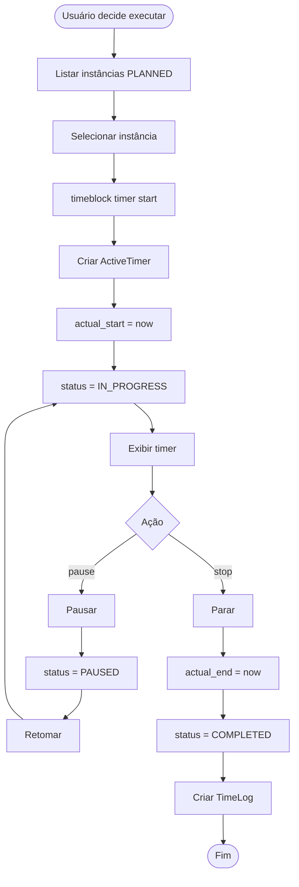

# Fluxo de Atividade: Executar Hábito

- **Versão:** 1.0.0
- **Data:** 31 de Outubro de 2025

```mermaid
flowchart TD
    Start([Usuário decide executar]) --> List[Listar instâncias PLANNED]
    List --> Select[Selecionar instância]
    Select --> StartCmd[timeblock timer start]

    StartCmd --> CreateTimer[Criar ActiveTimer]
    CreateTimer --> SetStart[actual_start = now]
    SetStart --> ChangeStatus[status = IN_PROGRESS]
    ChangeStatus --> Display[Exibir timer]

    Display --> UserAction{Ação}

    UserAction -->|pause| PauseTimer[Pausar]
    UserAction -->|stop| StopTimer[Parar]

    PauseTimer --> StatusPaused[status = PAUSED]
    StatusPaused --> Resume[Retomar]
    Resume --> ChangeStatus

    StopTimer --> SetEnd[actual_end = now]
    SetEnd --> Complete[status = COMPLETED]
    Complete --> CreateLog[Criar TimeLog]
    CreateLog --> End([Fim])
```
