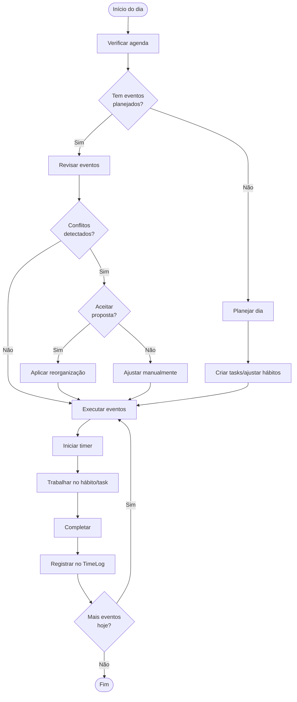

# Fluxo de Atividade: Dia Típico do Usuário

- **Versão:** 1.0.0
- **Data:** 31 de Outubro de 2025

```mermaid
flowchart TD
    Start([Início do dia]) --> Check[Verificar agenda]
    Check --> HasEvents{Tem eventos<br/>planejados?}

    HasEvents -->|Não| Plan[Planejar dia]
    HasEvents -->|Sim| Review[Revisar eventos]

    Plan --> Create[Criar tasks/ajustar hábitos]
    Review --> Conflicts{Conflitos<br/>detectados?}

    Conflicts -->|Sim| Decide{Aceitar<br/>proposta?}
    Conflicts -->|Não| Execute

    Decide -->|Sim| Apply[Aplicar reorganização]
    Decide -->|Não| Manual[Ajustar manualmente]

    Apply --> Execute[Executar eventos]
    Manual --> Execute
    Create --> Execute

    Execute --> Timer[Iniciar timer]
    Timer --> Work[Trabalhar no hábito/task]
    Work --> Complete[Completar]

    Complete --> Log[Registrar no TimeLog]
    Log --> More{Mais eventos<br/>hoje?}

    More -->|Sim| Execute
    More -->|Não| End([Fim])
```
