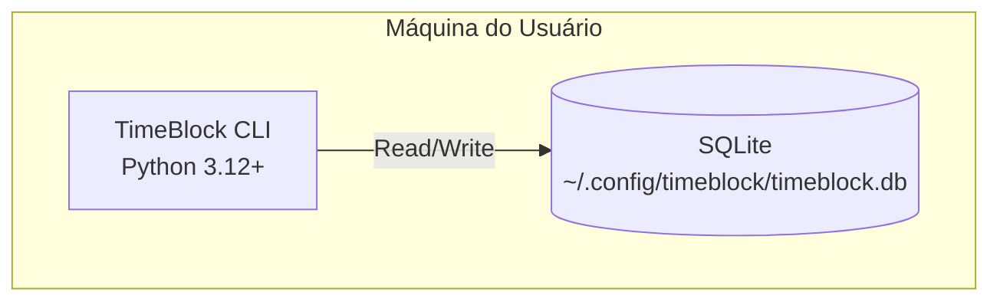

# Diagrama de Deployment

- **Versão:** 1.0.0
- **Data:** 31 de Outubro de 2025

**Componentes:**

- CLI: Python 3.12+, Typer
- DB: SQLite 3.x, local
- Dependências: typer, sqlmodel, rich, pydantic
