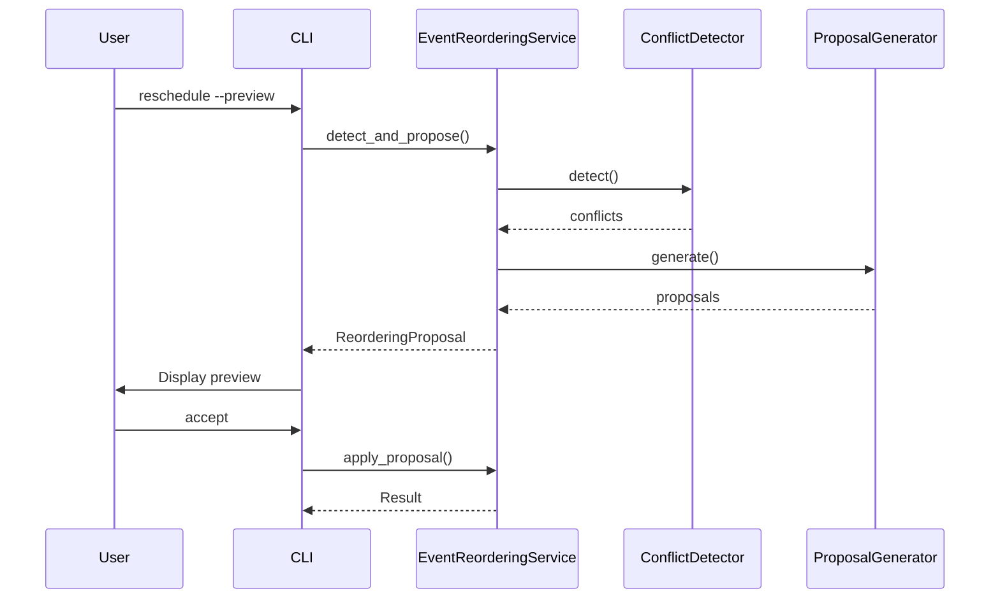

# Sequência: Event Reordering

```mermaid
sequenceDiagram
    User->>CLI: reschedule --preview
    CLI->>EventReorderingService: detect_and_propose()
    EventReorderingService->>ConflictDetector: detect()
    ConflictDetector-->>EventReorderingService: conflicts
    EventReorderingService->>ProposalGenerator: generate()
    ProposalGenerator-->>EventReorderingService: proposals
    EventReorderingService-->>CLI: ReorderingProposal
    CLI->>User: Display preview
    User->>CLI: accept
    CLI->>EventReorderingService: apply_proposal()
    EventReorderingService-->>CLI: Result
```
