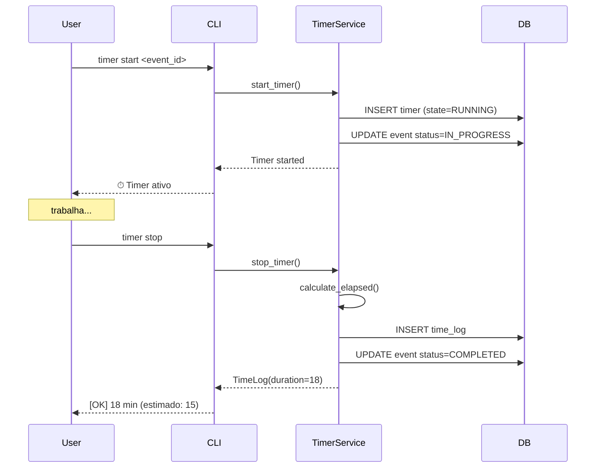

# Sequência: Timer Lifecycle

```mermaid
sequenceDiagram
    User->>CLI: timer start <event_id>
    CLI->>TimerService: start_timer()
    TimerService->>DB: INSERT timer (state=RUNNING)
    TimerService->>DB: UPDATE event status=IN_PROGRESS
    TimerService-->>CLI: Timer started
    CLI-->>User: ⏱ Timer ativo

    Note over User: trabalha...

    User->>CLI: timer stop
    CLI->>TimerService: stop_timer()
    TimerService->>TimerService: calculate_elapsed()
    TimerService->>DB: INSERT time_log
    TimerService->>DB: UPDATE event status=COMPLETED
    TimerService-->>CLI: TimeLog(duration=18)
    CLI-->>User: [OK] 18 min (estimado: 15)
```
