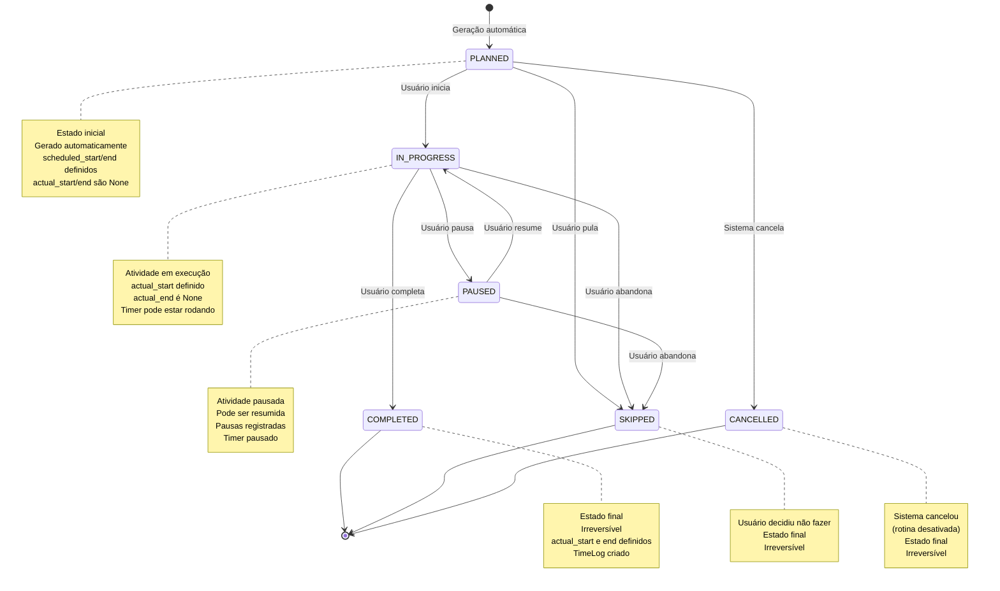

# Diagrama de Estados: Events (HabitInstance)

- **Versão:** 1.0.0
- **Data:** 31 de Outubro de 2025
- **Última Atualização:** 31 de Outubro de 2025

---

## 1. VISÃO GERAL

Este diagrama documenta todos os estados possíveis de uma HabitInstance (evento de hábito) e suas transições válidas durante seu ciclo de vida.

**Conceito:**
Uma HabitInstance representa uma ocorrência específica de um hábito em uma data específica. Durante sua existência, ela transita por estados bem definidos desde o planejamento até a conclusão ou cancelamento.

---

## 2. DIAGRAMA DE ESTADOS



---

## 3. DESCRIÇÃO DOS ESTADOS

### 3.1 PLANNED

**Descrição:**
Estado inicial de toda HabitInstance após geração automática pelo sistema. Indica que a instância foi planejada mas o usuário ainda não interagiu com ela.

**Características:**

- `status`: `PLANNED`

- `scheduled_start`: Definido (horário planejado de início)

- `scheduled_end`: Definido (horário planejado de fim)

- `actual_start`: `None` (ainda não iniciou)

- `actual_end`: `None` (ainda não terminou)

- `user_override`: `False` (não foi ajustado manualmente)

**Transições Permitidas:**

- `PLANNED → IN_PROGRESS`: Usuário executa `timeblock timer start`

- `PLANNED → SKIPPED`: Usuário executa `timeblock habit skip`

- `PLANNED → CANCELLED`: Sistema desativa rotina

**Exemplo:**

```python
instance = HabitInstance(
    habit_id=1,
    date=date(2025, 10, 31),
    scheduled_start=time(7, 0),
    scheduled_end=time(8, 0),
    status=HabitInstanceStatus.PLANNED,
    actual_start=None,
    actual_end=None
)
```

### 3.2 IN_PROGRESS

**Descrição:**
Atividade em execução. Usuário iniciou o hábito e está ativamente trabalhando nele.

**Características:**

- `status`: `IN_PROGRESS`

- `scheduled_start/end`: Mantidos (horário planejado)

- `actual_start`: Definido (momento em que usuário iniciou)

- `actual_end`: `None` (ainda em execução)

- Timer associado pode estar rodando

**Transições Permitidas:**

- `IN_PROGRESS → PAUSED`: Usuário executa `timeblock timer pause`

- `IN_PROGRESS → COMPLETED`: Usuário executa `timeblock timer stop`

- `IN_PROGRESS → SKIPPED`: Usuário abandona antes de completar

### 3.3 PAUSED

**Descrição:**
Atividade temporariamente pausada. Usuário interrompeu execução mas pretende retomar.

**Características:**

- `status`: `PAUSED`

- `actual_start`: Mantido (quando iniciou)

- `actual_end`: `None` (não completou ainda)

- Pausas registradas em lista

- Timer pausado

**Transições Permitidas:**

- `PAUSED → IN_PROGRESS`: Usuário executa `timeblock timer resume`

- `PAUSED → SKIPPED`: Usuário desiste e abandona

### 3.4 COMPLETED

**Descrição:**
Estado final. Atividade foi completada com sucesso. Este estado é irreversível.

**Características:**

- `status`: `COMPLETED`

- `actual_start`: Definido (quando iniciou)

- `actual_end`: Definido (quando completou)

- TimeLog criado automaticamente

- Estado irreversível

**Transições Permitidas:**

- Nenhuma (estado final)

**Exemplo:**

```python
instance.status = HabitInstanceStatus.COMPLETED
instance.actual_start = datetime(2025, 10, 31, 7, 2, 0)
instance.actual_end = datetime(2025, 10, 31, 7, 58, 0)

# TimeLog gerado automaticamente
time_log = TimeLog(
    habit_instance_id=instance.id,
    started_at=instance.actual_start,
    ended_at=instance.actual_end,
    duration_minutes=56
)
```

### 3.5 SKIPPED

**Descrição:**
Usuário decidiu conscientemente não executar este hábito nesta data. Estado final irreversível.

**Características:**

- `status`: `SKIPPED`

- `actual_start`: `None` (nunca iniciou)

- `actual_end`: `None` (nunca completou)

- Motivo pode ser registrado (opcional)

- Estado irreversível

**Transições Permitidas:**

- Nenhuma (estado final)

### 3.6 CANCELLED

**Descrição:**
Sistema cancelou esta instância por motivos externos (desativação de rotina, deleção de hábito). Estado final irreversível.

**Características:**

- `status`: `CANCELLED`

- `actual_start`: `None` (nunca foi iniciado)

- `actual_end`: `None` (nunca completou)

- Motivo: mudança no template/rotina, não decisão do usuário

- Estado irreversível

**Transições Permitidas:**

- Nenhuma (estado final)

**Exemplo:**

```python
# Rotina foi desativada, todas instâncias futuras são canceladas
routine.is_active = False

for instance in future_instances:
    instance.status = HabitInstanceStatus.CANCELLED
```

---

## 4. REGRAS DE TRANSIÇÃO

### 4.1 Transições Válidas

```python
ALLOWED_TRANSITIONS = {
    HabitInstanceStatus.PLANNED: [
        HabitInstanceStatus.IN_PROGRESS,
        HabitInstanceStatus.SKIPPED,
        HabitInstanceStatus.CANCELLED
    ],
    HabitInstanceStatus.IN_PROGRESS: [
        HabitInstanceStatus.PAUSED,
        HabitInstanceStatus.COMPLETED,
        HabitInstanceStatus.SKIPPED
    ],
    HabitInstanceStatus.PAUSED: [
        HabitInstanceStatus.IN_PROGRESS,
        HabitInstanceStatus.SKIPPED
    ],
    # Estados finais não têm transições
    HabitInstanceStatus.COMPLETED: [],
    HabitInstanceStatus.SKIPPED: [],
    HabitInstanceStatus.CANCELLED: []
}
```

### 4.2 Validação de Transição

```python
def transition_to(self, new_status: HabitInstanceStatus) -> None:
    """
    Transiciona instância para novo estado, validando se transição é permitida.

    Raises:
        ValueError: Se transição não é permitida
    """
    if new_status not in ALLOWED_TRANSITIONS.get(self.status, []):
        raise ValueError(
            f"Transição inválida: {self.status} → {new_status}"
        )

    self.status = new_status

    # Side effects
    if new_status == HabitInstanceStatus.IN_PROGRESS and not self.actual_start:
        self.actual_start = datetime.now()

    if new_status == HabitInstanceStatus.COMPLETED:
        self.actual_end = datetime.now()
```

---

## 5. REGRAS DE NEGÓCIO ASSOCIADAS

### 5.1 Regras Implementadas

- **RN-HI02:** Estados de instância e transições válidas
- **RN-HI03:** actual_start é setado quando status → IN_PROGRESS
- **RN-HI05:** actual_end é setado quando status → COMPLETED
- **RN-TL02:** TimeLog é criado automaticamente quando status → COMPLETED
- **RN-R03:** Instâncias futuras são setadas para CANCELLED ao desativar rotina

### 5.2 Campos Relacionados

```python
class HabitInstance(SQLModel, table=True):
    # Identificação
    id: int | None
    habit_id: int  # FK → Habit
    date: date

    # Horários planejados
    scheduled_start: time
    scheduled_end: time

    # Estado e execução
    status: HabitInstanceStatus  # ESTADOS DOCUMENTADOS AQUI
    actual_start: datetime | None
    actual_end: datetime | None

    # Controles
    user_override: bool = False
    manually_adjusted: bool = False
```

---

## 6. IMPLEMENTAÇÃO

### 6.1 Localização no Código

**Model:**

```terminal
cli/src/timeblock/models/habit_instance.py
class HabitInstance(SQLModel, table=True)
class HabitInstanceStatus(str, Enum)
```

**Service:**

```terminal
cli/src/timeblock/services/habit_instance_service.py
class HabitInstanceService
```

**Testes:**

```terminal
cli/tests/unit/test_models.py
cli/tests/unit/test_services/test_habit_instance_service.py
```

---

## 7. HISTÓRICO

| Data       | Versão | Mudança                                                        |
| ---------- | ------ | -------------------------------------------------------------- |
| 16/10/2025 | 0.9.0  | Estados PLANNED, IN_PROGRESS, COMPLETED, SKIPPED implementados |
| 20/10/2025 | 0.9.1  | Estado PAUSED adicionado para suporte a timer                  |
| 31/10/2025 | 1.0.0  | Estado CANCELLED adicionado, documentação completa criada      |

---

## 8. REFERÊNCIAS

**Documentação Relacionada:**

- [BR002: Event Conflicts](../../04-specifications/business-rules/BR002-event-conflicts.md)
- [Habit Instance Service](../../05-api/services/habit-service.md)
- [Timer States](./timer-states.md)

**Código-Fonte:**

- `cli/src/timeblock/models/habit_instance.py`

- `cli/src/timeblock/services/habit_instance_service.py`

**ADRs Relacionados:**

- ADR-004: Habit vs Instance Separation

---

- **Documento:** event-states.md
- **Localização:** `docs/02-diagrams/states/event-states.md`
- **Formato:** arc42 Section 2 (Constraints) + Mermaid Diagrams
