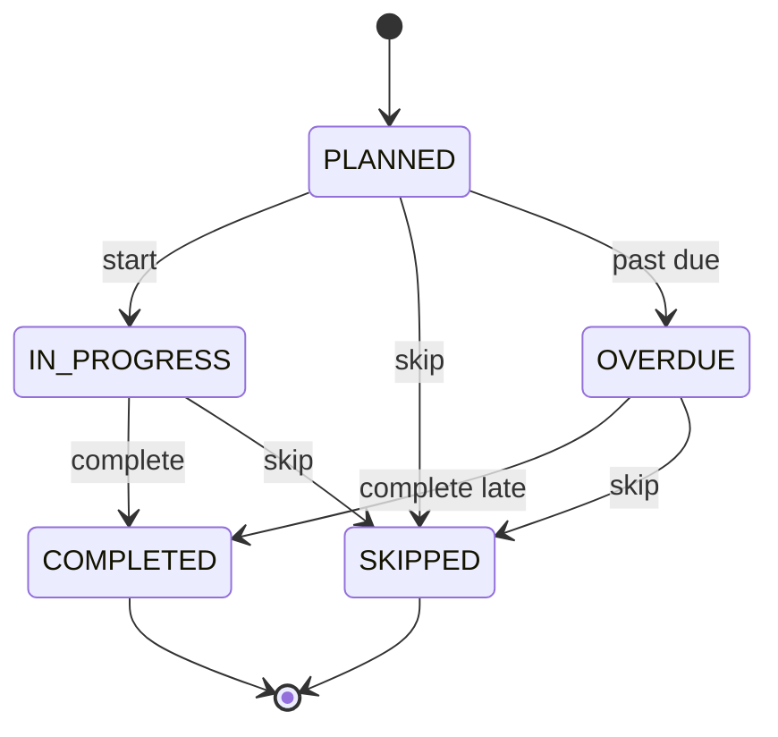

# Estados: Habit Lifecycle

```mermaid
stateDiagram-v2
    [*] --> PLANNED
    PLANNED --> IN_PROGRESS: start
    PLANNED --> SKIPPED: skip
    PLANNED --> OVERDUE: past due
    IN_PROGRESS --> COMPLETED: complete
    IN_PROGRESS --> SKIPPED: skip
    OVERDUE --> COMPLETED: complete late
    OVERDUE --> SKIPPED: skip
    COMPLETED --> [*]
    SKIPPED --> [*]
```
