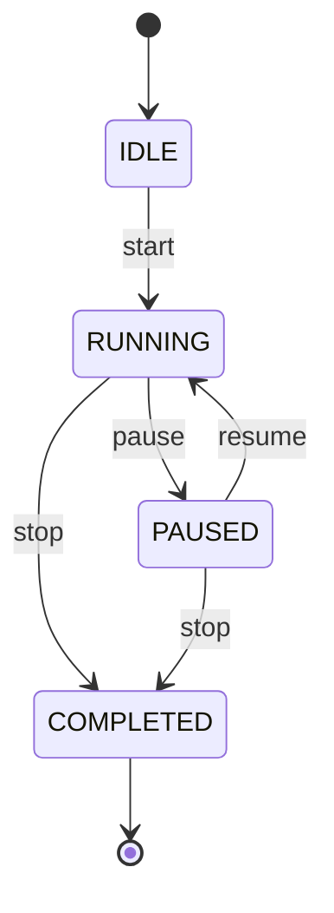

# Estados: Timer

```mermaid
stateDiagram-v2
    [*] --> IDLE
    IDLE --> RUNNING: start
    RUNNING --> PAUSED: pause
    PAUSED --> RUNNING: resume
    RUNNING --> COMPLETED: stop
    PAUSED --> COMPLETED: stop
    COMPLETED --> [*]
```
